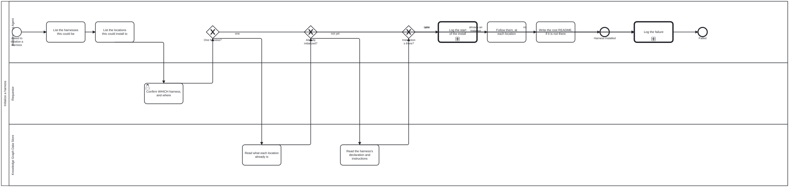
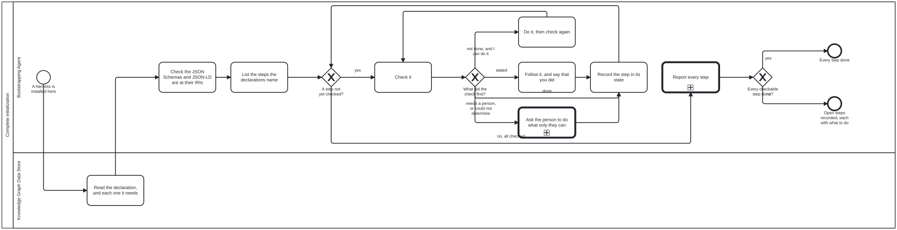
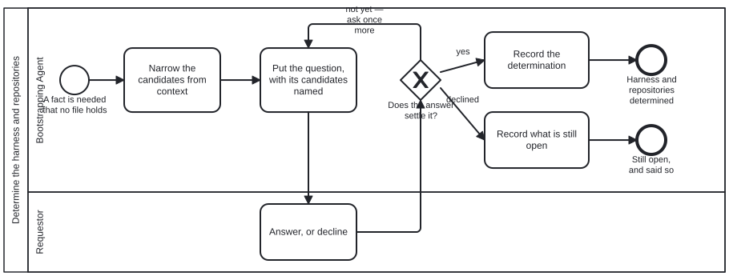
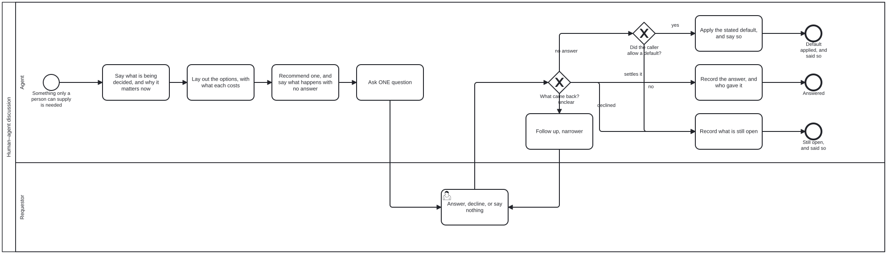
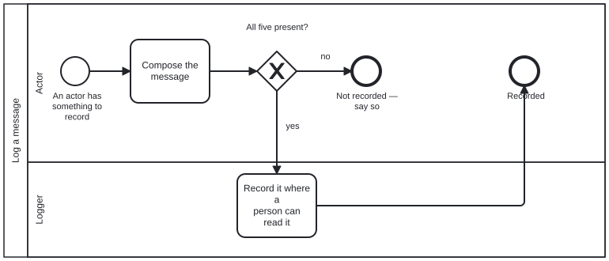


# Bootstrap

The graph an agent reads before it knows what this repository is.

*Every README in this repository on one page: the root's first, then each directory's, in path order. Generated by bootstrap-tools (scripts/readme-book.ts) from the READMEs — do not edit; edit a README instead.*

## Contents

1. [bootstrap](#readme) — `README.md`
   - [What you are setting up](#readme--what-you-are-setting-up)
   - [Who takes part](#readme--who-takes-part)
   - [User story](#readme--user-story)
   - [Steps](#readme--steps)
   - [Functional Requirements](#readme--functional-requirements)
   - [Reading it on the web](#readme--reading-it-on-the-web)
   - [Every file here](#readme--every-file-here)
2. [models](#models) — `models/README.md`
3. [processes](#processes) — `processes/README.md`
4. [scenarios](#scenarios) — `scenarios/README.md`
5. [schemas](#schemas) — `schemas/README.md`
   - [Schemas, drawn](#schemas--schemas-drawn)
6. [skills](#skills) — `skills/README.md`
7. [Published documents](#published-documents)

---

## <a id="readme"></a>bootstrap

*From [`README.md`](README.md).*

This directory is where an agent starts when it has been handed a repository
and knows nothing else about it. Everything here is a file to read: text
(`.md`), data (`.json`) and diagrams (`.bpmn`). Nothing here is a program, so
you need nothing installed to use it.

A capitalized word on this page is a defined term. It links to its definition
the first time it appears, and `[src]` beside it opens the schema that defines
it. Every definition is drawn on one page,
[`schemas/README.md`](#schemas), from one file,
[`schemas/graph.schema.json`](schemas/graph.schema.json).

**Contents**

<!-- kg:toc:begin -->

- [What you are setting up](#readme--what-you-are-setting-up)
- [Who takes part](#readme--who-takes-part)
- [User story](#readme--user-story)
- [Steps](#readme--steps)
- [Functional Requirements](#readme--functional-requirements)
- [Reading it on the web](#readme--reading-it-on-the-web)
- [Every file here](#readme--every-file-here)

<!-- kg:toc:end -->

---

### <a id="readme--what-you-are-setting-up"></a>What you are setting up

A [Knowledge Graph](#schemas--knowledge-graph) ([src](schemas/graph.schema.json#/$defs/KnowledgeGraph)) is
information kept as files in a repository: things, and the named relations
between them. One file at its root, `<name>.json`, declares it. That file
gives its name and lists its
[Subgraphs](#schemas--subgraph) ([src](schemas/graph.schema.json#/$defs/Subgraph)), the named directories
it is divided into.

A [Harness](#schemas--harness) ([src](schemas/graph.schema.json#/$defs/Harness)) is what you use to work
with a [Knowledge Graph](#schemas--knowledge-graph). A [Harness](#schemas--harness) is a [Knowledge Graph](#schemas--knowledge-graph) too, declared the same
way. This directory is the first [Harness](#schemas--harness), `bootstrap`, declared by
[`bootstrap.json`](bootstrap.json).

**Setting up a repository means instantiating one or more different kinds of
[Knowledge Graph](#schemas--knowledge-graph) [Harness](#schemas--harness) on the data in the repository.** A person chooses which
ones, and the choice is hard to undo.

---

### <a id="readme--who-takes-part"></a>Who takes part

An [Actor](#schemas--actor) ([src](schemas/graph.schema.json#/$defs/Actor)) is a person, an agent or a
program. Each [Actor](#schemas--actor) takes a [Role](#schemas--role) ([src](schemas/graph.schema.json#/$defs/Role)), and
the four [Roles](#schemas--role) here are declared in [`scenarios/roles.json`](scenarios/roles.json):

| Role | who plays it |
|---|---|
| **Bootstrapping Agent** | you: the agent setting the repository up |
| **Requestor** | the person who asked for it. Only the Requestor chooses the [Harness](#schemas--harness). |
| **Knowledge Graph Data Store** | a repository: the one being set up, and any a [Harness](#schemas--harness) is read from |
| **Logger** | the record of what you did. Here, it is the conversation you are in. |

The same four, as [`scenarios/roles.json`](scenarios/roles.json) defines them, with every
name each goes by: other names in use today, and former names with the day each
was retired, so a name met in older text still leads to the right one.

<!-- kg:roles:begin -->

| Role | what it is | also called | formerly |
|---|---|---|---|
| **Bootstrapping Agent** | An agent asked to set up a [Harness](#schemas--harness) with ONLY the knowledge bootstrap's README.md hands it. |  | Initiator (until 2026-09-23) |
| **Knowledge Graph Data Store** | A git repository, reached either through the git CLI or through a forge's API. |  |  |
| **Requestor** | Wants to initialize — or bootstrap, or install, or load, or harness — a harness: bootstrap itself, or any [Harness](#schemas--harness) built on it. |  |  |
| **Logger** | A machine that accepts log messages and puts them somewhere a person can read. |  |  |

<!-- kg:roles:end -->

As the Bootstrapping Agent you have no [Harness](#schemas--harness) yet, so you have no
tools (programs to call): a [Harness](#schemas--harness) defines those, and bootstrap does not. If a step
seems to need one, it belongs to the [Harness](#schemas--harness) you are about to set up, not to
this one.

---

### <a id="readme--user-story"></a>User story

> **As** the Bootstrapping Agent, **I want** to set up the repository I was handed as
> the [Harness](#schemas--harness) the Requestor chooses, **so that** everything added to it later
> is built on the right [Harness](#schemas--harness).

The story ends in one of two ways, and both are acceptable: the [Harness](#schemas--harness) is set
up, or the reason it could not be is recorded.

---

### <a id="readme--steps"></a>Steps

The steps are drawn as a
[Process](#schemas--process) ([src](schemas/graph.schema.json#/$defs/Process)),
[`initialize-harness.bpmn`](processes/initialize-harness.bpmn). It is the only
[Process](#schemas--process) you start; every other one is called from a step. Each step names the
[Skill](#schemas--skill) ([src](schemas/graph.schema.json#/$defs/Skill)) to read and the Functional
Requirement it must meet (see the next section).

```text
 1  Learn how to open files here
 |
 2  Determine the Harness and repositories  --- ask --->  the Requestor chooses one Harness
 |
 3  Check each repository  --- already this Harness? --->  go to 7
 |                         --- already another one? --->  record it and stop
 4  Record that you are starting
 |
 5  Follow the chosen Harness's own instructions
 |
 6  Leave a README at the repository's root, if it has none
 |
 7  Make sure every step the declarations name is done  --- only a person can? ---> ask
      first: the JSON Schemas and JSON-LD at the IRIs they name
 |
    Harness installed, every step reported: done, not done, could not determine, or stated

    At any step: something cannot be found or read  --->  record it and stop
    Whenever a person must decide or act  --->  the one human-agent discussion
```

The same steps, and the [Processes](#schemas--process) they start, as the diagrams themselves:

<!-- kg:processes:begin -->

**Initialize a harness**: [`processes/initialize-harness.bpmn`](processes/initialize-harness.bpmn), the one you start; it calls "Determine the harness and repositories", "Log a message" and "Complete initialization".



**Complete initialization**: [`processes/complete-initialization.bpmn`](processes/complete-initialization.bpmn), started from "Initialize a harness"; it calls "Human–agent discussion" and "Log a message".



**Determine the harness and repositories**: [`processes/discussion.bpmn`](processes/discussion.bpmn), started from "Initialize a harness"; it calls "Human–agent discussion".



**Human–agent discussion**: [`processes/human-agent-discussion.bpmn`](processes/human-agent-discussion.bpmn), a reusable sub-process, started from "Complete initialization" and "Determine the harness and repositories".



**Log a message**: [`processes/log-message.bpmn`](processes/log-message.bpmn), a reusable sub-process, started from "Complete initialization" and "Initialize a harness".



<!-- kg:processes:end -->

1. **Learn how to open files here.** Read
   [`skills/bootstrap-kg-navigation.md`](skills/bootstrap-kg-navigation.md).
   Opening files is all you can do (Functional Requirement 1, FR-1).
2. **Determine the Harness and repositories.** List the
   Harnesses the repository could become, and the repositories it could be
   set up in. Then ask the Requestor for one Harness and its repositories
   (FR-3), through the one reusable discussion (FR-9). Read
   [`skills/confirm-harness.md`](skills/confirm-harness.md) for what to ask,
   and [`skills/human-agent-discussion.md`](skills/human-agent-discussion.md)
   for how.
   This step is done when the answer is written down as a document that
   matches [`schemas/discussion.output.schema.json`](schemas/discussion.output.schema.json).
3. **Check each repository.** If its root already holds a declaration,
   `<name>.json`, it is already set up (FR-5). If it is the Harness the
   Requestor chose, go straight to step 7; if it is another, record that and
   stop.
4. **Record that you are starting.** Read
   [`skills/log-message.md`](skills/log-message.md).
5. **Follow the chosen Harness's own instructions.** Every Harness keeps them
   at the same path (FR-4):

   ```
   <name>/docs/bootstrap/initialization.md
   ```

   Here `<name>` is the name the Requestor chose, as it appears in that
   Harness's declaration, `<name>.json`.
6. **Leave a README at the repository's root, if it has none** (FR-8). Read
   [`skills/root-readme.md`](skills/root-readme.md).
7. **Make sure every step is done** (FR-10). The steps are the ones the
   declarations name. **First, and primary: the Harness's JSON Schemas and
   JSON-LD documents are published at the IRIs they name** (FR-11; read
   [`skills/publish-documents.md`](skills/publish-documents.md)). Then the
   declared directories and files, the README and the sections it opts
   into, each needed Harness's own instructions, and the site on GitHub
   Pages, which is how the documents get to their addresses. Check each one before doing anything, do what you
   can, and ask the person for what only they can do. Read
   [`skills/initialization-steps.md`](skills/initialization-steps.md) and,
   for the site, [`skills/publish-site.md`](skills/publish-site.md). Where
   bootstrap-tools is available, its `init` command performs the same checks.

If anything cannot be found or read along the way, record what failed (step
4's Skill) and stop (FR-6).

---

### <a id="readme--functional-requirements"></a>Functional Requirements

A Functional Requirement is a rule the steps must meet. Each has a number, so
a step can name it: Functional Requirement 1 is FR-1.

| | rule |
|---|---|
| **FR-1** | Everything named here can be reached by opening files, and by nothing else. |
| **FR-2** | You start one Process, `initialize-harness`. The Processes `discussion`, `human-agent-discussion`, `complete-initialization` and `log-message` are started only by steps of another Process. |
| **FR-3** | Only the Requestor chooses the Harness. You may shorten the list of candidates, but never choose between two. |
| **FR-4** | Every Harness keeps its set-up instructions at `<name>/docs/bootstrap/initialization.md`, so you can set up a Harness you have never seen. |
| **FR-5** | A repository whose root already holds a declaration is already set up. You never set it up again: if it is the chosen Harness, you only check its steps (FR-10); if it is another, you record that and stop. |
| **FR-6** | Anything that cannot be found or read is recorded, and stops the Process. Nothing is worked around. |
| **FR-7** | This directory holds no program code, so FR-1 stays true. |
| **FR-8** | When the set-up succeeds, the repository's root has a `README.md` naming the Harness and whether the set-up succeeded everywhere. An existing README is added to, never replaced. |
| **FR-9** | Whenever a step needs a person to decide or to act, it calls `human-agent-discussion`: context, options, a recommendation and what happens with no answer, then one question. A default applies only where the calling step allows one. |
| **FR-10** | Every initialization step the declarations name is checked before anything is done, and reported as done, not done, could not determine, or stated. "Could not determine" is never reported as done, and nothing somebody wrote is replaced. |
| **FR-11** | A Knowledge Graph Harness's JSON Schemas and JSON-LD documents (its vocabulary, its diagram vocabulary, its graph, each with its `@context`) are published at the IRIs they name. It is the primary initialization step: checked first after the declarations are read, and first in the report. A site is how they get there, not the goal. |

---

### <a id="readme--reading-it-on-the-web"></a>Reading it on the web

Every README here, the root's first and then each directory's, is also one
page with a table of contents at `https://litlfred.github.io/bootstrap/`,
beside every file as it sits here. The page is built by `bootstrap-tools`, a
separate repository beside this one, from these files, on each push to
`main`, by the workflow in
[`.github/workflows/pages.yml`](.github/workflows/pages.yml). That workflow
is the one file here that is not text, data or a diagram. It configures a
build that runs somewhere else, and no step in this README reads it
(FR-7). The site is also the first repository to go through its own step 7:
[`skills/publish-site.md`](skills/publish-site.md).

---

### <a id="readme--every-file-here"></a>Every file here

Grouped by directory, each described from the file itself. "Used by" names the
Process that reads a file, where a diagram says so.

<!-- kg:files:begin -->

**At the top**

| file | what it is | used by |
|---|---|---|
| [`AGENTS.md`](AGENTS.md) | Phase one of two. |  |
| [`README.md`](#readme) | The flow, with every term linked to the schema that defines it. |  |
| [`ns.jsonld`](ns.jsonld) | Every term bootstrap defines, in order, and every Graph Kind it defines, as RDF and SKOS — the document bootstrap's namespace resolves to. |  |
| [`bootstrap.json`](bootstrap.json) | Bootstrap |  |

**[`skills/`](#skills)**

| file | what it is | used by |
|---|---|---|
| [`bootstrap-graph-emission.md`](skills/bootstrap-graph-emission.md) | What bootstrap's own Knowledge Graph must be when it is written out as a data file, `.jsonld` with a `.json` copy. |  |
| [`bootstrap-graph-publication.md`](skills/bootstrap-graph-publication.md) | Where bootstrap's Knowledge Graph file is published, why its `@id` must be exactly that address, why a `.json` copy sits beside the `.jsonld`, and why the fi… |  |
| [`bootstrap-kg-navigation.md`](skills/bootstrap-kg-navigation.md) | Read and navigate a knowledge graph with nothing installed — no MCP server, no tools, no harness. | "Complete initialization", "Initialize a harness" |
| [`confirm-harness.md`](skills/confirm-harness.md) | Narrow the harnesses and locations this could be, then have the Requestor settle it. | "Determine the harness and repositories", "Initialize a harness" |
| [`discussion.md`](skills/discussion.md) | discussion — settling what an agent cannot read off disk |  |
| [`human-agent-discussion.md`](skills/human-agent-discussion.md) | Ask a person (or a sibling agent) for what no file holds: context, then the options, then a recommendation and what happens with no answer, then ONE question. | "Complete initialization", "Determine the harness and repositories", "Human–agent discussion" |
| [`initialization-steps.md`](skills/initialization-steps.md) | Walk every initialization step the declarations name (the instance's own and each one it needs), check each before doing anything, do what can be done, ask f… | "Complete initialization", "Initialize a harness" |
| [`log-message.md`](skills/log-message.md) | Say what you are doing, to the Logger, in a form a reader can act on. | "Complete initialization", "Initialize a harness", "Log a message" |
| [`package-manifest.json`](skills/package-manifest.json) | What an agent reads before it knows whether this repository is an instance, what kind, or what for. |  |
| [`publish-documents.md`](skills/publish-documents.md) | The primary step of initializing a Knowledge Graph harness: every JSON Schema and JSON-LD document it names an address for (schemas, vocabulary, diagram voca… | "Complete initialization" |
| [`publish-site.md`](skills/publish-site.md) | Give an instance a site: its Knowledge Graph rendered for publication at its site address, and the address answering. | "Complete initialization" |
| [`root-readme.md`](skills/root-readme.md) | Write the repository's root README when there is none, carrying a link to the harness that was installed and the overall install status. | "Initialize a harness" |

**[`schemas/`](#schemas)**: The schemas bootstrap is checked against: `graph.schema.json`, the shape of a declaration and the definition of every term bootstrap uses; and the input and…

| file | what it is | used by |
|---|---|---|
| [`discussion.input.schema.json`](schemas/discussion.input.schema.json) | Discussion Input |  |
| [`discussion.output.schema.json`](schemas/discussion.output.schema.json) | Discussion Output |  |
| [`graph.schema.json`](schemas/graph.schema.json) | Knowledge Graph declaration |  |
| [`model-registry.schema.json`](schemas/model-registry.schema.json) | Model Registry |  |
| [`requirement.schema.json`](schemas/requirement.schema.json) | Requirement |  |

**[`scenarios/`](#scenarios)**: bootstrap's four Roles: Bootstrapping Agent, Requestor, Knowledge Graph Data Store and Logger.

| file | what it is | used by |
|---|---|---|
| [`roles.json`](scenarios/roles.json) | data |  |

**[`processes/`](#processes)**: bootstrap's Processes: `initialize-harness.bpmn`, the only one an Actor starts; `discussion.bpmn`, which it calls to determine the harness and repositories;…

| file | what it is | used by |
|---|---|---|
| [`complete-initialization.bpmn`](processes/complete-initialization.bpmn) | a Process: Complete initialization | "Initialize a harness" |
| [`complete-initialization.svg`](processes/complete-initialization.svg) | the picture of `complete-initialization.bpmn`, generated from it |  |
| [`discussion.bpmn`](processes/discussion.bpmn) | a Process: Determine the harness and repositories | "Initialize a harness" |
| [`discussion.svg`](processes/discussion.svg) | the picture of `discussion.bpmn`, generated from it |  |
| [`human-agent-discussion.bpmn`](processes/human-agent-discussion.bpmn) | a Process: Human–agent discussion | "Complete initialization", "Determine the harness and repositories" |
| [`human-agent-discussion.svg`](processes/human-agent-discussion.svg) | the picture of `human-agent-discussion.bpmn`, generated from it |  |
| [`initialize-harness.bpmn`](processes/initialize-harness.bpmn) | a Process: Initialize a harness |  |
| [`initialize-harness.svg`](processes/initialize-harness.svg) | the picture of `initialize-harness.bpmn`, generated from it |  |
| [`log-message.bpmn`](processes/log-message.bpmn) | a Process: Log a message | "Complete initialization", "Initialize a harness" |
| [`log-message.svg`](processes/log-message.svg) | the picture of `log-message.bpmn`, generated from it |  |
| [`ns.jsonld`](processes/ns.jsonld) | bootstrap's diagram elements |  |

**[`models/`](#models)**: Which languages a model is good at, and whether anybody checked.

| file | what it is | used by |
|---|---|---|
| [`models.json`](models/models.json) | Which languages a model is good at, and whether anybody checked. |  |

<!-- kg:files:end -->

---

## <a id="models"></a>models

*From [`models/README.md`](models/README.md).*

<!-- kg:subgraph:begin -->

Which languages a model is good at, and whether anybody checked. In BOOTSTRAP for the reason everything else here is: an agent reaching for the language it should communicate in has not yet loaded the harness that would otherwise answer, so a registry one layer up would be unreachable in exactly the case it exists for. `context`: read when a session opens, never written by a process — a person grants a validation, an agent never does, because a model's own claim about its languages is the thing the validation state exists to distrust.

Part of [Bootstrap](#readme) 0.1.0, declared as `models`, holding `models`.

| file | what it is | used by |
|---|---|---|
| [`models.json`](models/models.json) | Which languages a model is good at, and whether anybody checked. |  |
<!-- kg:subgraph:end -->

---

## <a id="processes"></a>processes

*From [`processes/README.md`](processes/README.md).*

<!-- kg:subgraph:begin -->

bootstrap's [Processes](#schemas--process): `initialize-harness.bpmn`, the only one an [Actor](#schemas--actor) starts; `discussion.bpmn`, which it calls to determine the harness and repositories; `human-agent-discussion.bpmn`, the reusable discussion every diagram calls to ask a person anything; `complete-initialization.bpmn`, which checks every initialization step the declarations name; and `log-message.bpmn`, which any step may call to record what it is doing. `ns.jsonld` defines the elements these diagrams add to BPMN (skill, role, precondition), written with the prefix `bootstrap.processes:`.

Part of [Bootstrap](#readme) 0.1.0, declared as `processes`, holding `processes`.

| file | what it is | used by |
|---|---|---|
| [`complete-initialization.bpmn`](processes/complete-initialization.bpmn) | a [Process](#schemas--process): Complete initialization | "Initialize a harness" |
| [`complete-initialization.svg`](processes/complete-initialization.svg) | the picture of `complete-initialization.bpmn`, generated from it |  |
| [`discussion.bpmn`](processes/discussion.bpmn) | a [Process](#schemas--process): Determine the harness and repositories | "Initialize a harness" |
| [`discussion.svg`](processes/discussion.svg) | the picture of `discussion.bpmn`, generated from it |  |
| [`human-agent-discussion.bpmn`](processes/human-agent-discussion.bpmn) | a [Process](#schemas--process): Human–agent discussion | "Complete initialization", "Determine the harness and repositories" |
| [`human-agent-discussion.svg`](processes/human-agent-discussion.svg) | the picture of `human-agent-discussion.bpmn`, generated from it |  |
| [`initialize-harness.bpmn`](processes/initialize-harness.bpmn) | a [Process](#schemas--process): Initialize a harness |  |
| [`initialize-harness.svg`](processes/initialize-harness.svg) | the picture of `initialize-harness.bpmn`, generated from it |  |
| [`log-message.bpmn`](processes/log-message.bpmn) | a [Process](#schemas--process): Log a message | "Complete initialization", "Initialize a harness" |
| [`log-message.svg`](processes/log-message.svg) | the picture of `log-message.bpmn`, generated from it |  |
| [`ns.jsonld`](processes/ns.jsonld) | bootstrap's diagram elements |  |
<!-- kg:subgraph:end -->

---

## <a id="scenarios"></a>scenarios

*From [`scenarios/README.md`](scenarios/README.md).*

<!-- kg:subgraph:begin -->

bootstrap's four [Roles](#schemas--role): Bootstrapping Agent, Requestor, [Knowledge Graph](#schemas--knowledge-graph) Data Store and Logger.

Part of [Bootstrap](#readme) 0.1.0, declared as `scenarios`, holding `scenarios`.

| file | what it is | used by |
|---|---|---|
| [`roles.json`](scenarios/roles.json) | data |  |
<!-- kg:subgraph:end -->

---

## <a id="schemas"></a>schemas

*From [`schemas/README.md`](schemas/README.md).*

<!-- kg:subgraph:begin -->

The schemas bootstrap is checked against: `graph.schema.json`, the shape of a declaration and the definition of every term bootstrap uses; and the input and output of the discussion [Process](#schemas--process). Their published `$id`s do not change when a file moves.

Part of [Bootstrap](#readme) 0.1.0, declared as `schemas`, holding `schemas`.

| file | what it is | used by |
|---|---|---|
| [`discussion.input.schema.json`](schemas/discussion.input.schema.json) | Discussion Input |  |
| [`discussion.output.schema.json`](schemas/discussion.output.schema.json) | Discussion Output |  |
| [`graph.schema.json`](schemas/graph.schema.json) | [Knowledge Graph](#schemas--knowledge-graph) declaration |  |
| [`model-registry.schema.json`](schemas/model-registry.schema.json) | Model Registry |  |
| [`requirement.schema.json`](schemas/requirement.schema.json) | Requirement |  |
<!-- kg:subgraph:end -->

### <a id="schemas--schemas-drawn"></a>Schemas, drawn

<!-- Generated by bootstrap-tools (scripts/gen-bootstrap-schemas.ts) from the schemas in this directory — do not edit; change a schema. -->

Every JSON file bootstrap defines has a schema in this directory. This page
draws each one, so you can read it without reading JSON Schema.

How to read a drawing:

- Each box is one kind of JSON object. Its first line is its name.
- `*` marks a field that must be present.
- `[1]` means exactly one, `[0..1]` means optional, `[1..*]` means a list
  with at least one item, and `[0..*]` means a list that may be empty.
- A field that holds another object points to that object's box, below it.
- `[src]` opens the schema itself.

#### <a id="schemas--terms"></a>Terms

Each defined term, in the words of
[`graph.schema.json`](schemas/graph.schema.json), in order: each definition uses only terms
above it, and never itself. **Uses** lists them. **Defined by** is the
schema that defines the term: `src` is its entry in this directory, anything
else is the published standard bootstrap builds on. A term whose shape is
drawn below links to its drawing.

| # | Term | Definition | Uses | Defined by |
|---:|---|---|---|---|
| 1 | <a id="schemas--node"></a>**Node** | One file, or one part of a file addressable by an IRI fragment, named by an IRI. | — | [JSON-LD 1.1 node object](https://www.w3.org/TR/json-ld11/#node-objects) |
| 2 | <a id="schemas--reference"></a>**Reference** | A Node's naming of another Node by its IRI. | [Node](#schemas--node) | [IRI (RFC 3987)](https://www.rfc-editor.org/rfc/rfc3987) |
| 3 | <a id="schemas--node-schema"></a>**Node Schema** | A schema a Node can be checked against: a JSON Schema, or a published external schema such as BPMN's. | [Node](#schemas--node) | [JSON Schema draft-07](http://json-schema.org/draft-07/schema#) |
| 4 | <a id="schemas--node-kind"></a>**Node Kind** | A name paired with a Node Schema. | [Node Schema](#schemas--node-schema) | [src](schemas/graph.schema.json#/properties/nodeSchemas) |
| 5 | <a id="schemas--subkind"></a>**Subkind** | A Node Kind whose Node Schema requires everything another Node Kind's does, so every Node that satisfies it satisfies the other too. | [Node Kind](#schemas--node-kind), [Node Schema](#schemas--node-schema), [Node](#schemas--node) | [src](schemas/graph.schema.json#/$defs/Subkind) |
| 6 | <a id="schemas--node-instance"></a>**Node Instance** | A Node that names its Node Kind, in `$schema` or front matter, and satisfies that kind's Node Schema. | [Node](#schemas--node), [Node Kind](#schemas--node-kind), [Node Schema](#schemas--node-schema) | [src](schemas/graph.schema.json#/$defs/NodeInstance) |
| 7 | <a id="schemas--graph-kind"></a>**Graph Kind** | A named set of Node Kinds. | [Node Kind](#schemas--node-kind) | [src](schemas/graph.schema.json#/$defs/GraphKind) |
| 8 | <a id="schemas--declaration"></a>**Declaration** | A JSON document, `<name>.json`, that gives a name and lists directory entries and file entries. | — | [src](schemas/graph.schema.json#/$defs/Declaration) |
| 9 | <a id="schemas--extension"></a>**Extension** | A field of a Declaration, or of one of its entries, that is not defined here. A reader that does not recognise the field ignores it, and the rest of the Declaration keeps its meaning. | [Declaration](#schemas--declaration) | [src](schemas/graph.schema.json#/$defs/Extension) |
| 10 | <a id="schemas--subgraph"></a>**Subgraph** | A directory entry of a Declaration: an id, a directory, and the Graph Kinds its Node Instances' kinds belong to. Drawn in [Knowledge Graph declaration](#schemas--knowledge-graph-declaration). | [Declaration](#schemas--declaration), [Graph Kind](#schemas--graph-kind), [Node Instance](#schemas--node-instance) | [src](schemas/graph.schema.json#/$defs/Subgraph) |
| 11 | <a id="schemas--asset"></a>**Asset** | A file entry of a Declaration: one file about the repository itself, whose `role` field says what it is for. Drawn in [Knowledge Graph declaration](#schemas--knowledge-graph-declaration). | [Declaration](#schemas--declaration) | [src](schemas/graph.schema.json#/$defs/Asset) |
| 12 | <a id="schemas--knowledge-graph"></a>**Knowledge Graph** | The Node Schemas, Node Instances and Assets one Declaration lists, as of one version of the repository. Published as JSON-LD, the statements of each Subgraph's Node Instances form one named graph. Drawn in [Knowledge Graph declaration](#schemas--knowledge-graph-declaration). | [Node Schema](#schemas--node-schema), [Node Instance](#schemas--node-instance), [Asset](#schemas--asset), [Declaration](#schemas--declaration), [Subgraph](#schemas--subgraph) | [src](schemas/graph.schema.json#/$defs/KnowledgeGraph) |
| 13 | <a id="schemas--dependency"></a>**Dependency** | A Declaration's `needs` entry naming another Knowledge Graph. References may point from this graph's Node Instances into the named one, never back. | [Declaration](#schemas--declaration), [Knowledge Graph](#schemas--knowledge-graph), [Reference](#schemas--reference), [Node Instance](#schemas--node-instance) | [src](schemas/graph.schema.json#/$defs/Dependency) |
| 14 | <a id="schemas--content"></a>**Content** | Node Instances that describe the subject matter of a Knowledge Graph, such as records, documents, catalogues and their terms, rather than how to work with it. | [Node Instance](#schemas--node-instance), [Knowledge Graph](#schemas--knowledge-graph) | [src](schemas/graph.schema.json#/$defs/Content) |
| 15 | <a id="schemas--task"></a>**Task** | A unit of work, stated by what it needs to begin and what it produces. | — | [BPMN 2.0 `task`](https://www.omg.org/spec/BPMN/2.0/#task) |
| 16 | <a id="schemas--actor"></a>**Actor** | A person, an agent or a program that can carry out Tasks. | [Task](#schemas--task) | [PROV-O `Agent`](http://www.w3.org/ns/prov#Agent) |
| 17 | <a id="schemas--skill"></a>**Skill** | A Node Instance holding natural-language instructions an Actor follows to carry out a Task. | [Node Instance](#schemas--node-instance), [Actor](#schemas--actor), [Task](#schemas--task) | [src](schemas/graph.schema.json#/$defs/Skill) |
| 18 | <a id="schemas--role"></a>**Role** | A Node Instance naming a part an Actor takes on to carry out Tasks, and listing the Skills that part needs. | [Node Instance](#schemas--node-instance), [Actor](#schemas--actor), [Task](#schemas--task), [Skill](#schemas--skill) | [src](schemas/graph.schema.json#/$defs/Role) |
| 19 | <a id="schemas--process-node"></a>**Process Node** | A BPMN flow node: an activity (a task or call activity), a gateway, or an event. | — | [BPMN 2.0 `flowNode`](https://www.omg.org/spec/BPMN/2.0/#flowNode) |
| 20 | <a id="schemas--sequence-flow"></a>**Sequence Flow** | A directed connection in a BPMN process from one Process Node to the next. | [Process Node](#schemas--process-node) | [BPMN 2.0 `sequenceFlow`](https://www.omg.org/spec/BPMN/2.0/#sequenceFlow) |
| 21 | <a id="schemas--process"></a>**Process** | A Node Instance holding a BPMN process that coordinates Tasks: its Process Nodes, joined by Sequence Flows, sit in lanes that each name a Role. | [Node Instance](#schemas--node-instance), [Task](#schemas--task), [Process Node](#schemas--process-node), [Sequence Flow](#schemas--sequence-flow), [Role](#schemas--role) | [BPMN 2.0 `process`](https://www.omg.org/spec/BPMN/2.0/#process) |
| 22 | <a id="schemas--harness"></a>**Harness** | A Knowledge Graph whose Subgraphs hold Skills, Roles or Processes: what an Actor uses to work with a Knowledge Graph, including itself. | [Knowledge Graph](#schemas--knowledge-graph), [Subgraph](#schemas--subgraph), [Skill](#schemas--skill), [Role](#schemas--role), [Process](#schemas--process), [Actor](#schemas--actor) | [src](schemas/graph.schema.json#/$defs/Harness) |

#### <a id="schemas--discussion-input"></a>Discussion Input

[src](schemas/discussion.input.schema.json)

The occasion for asking: what the agent already knows, and which unknown is still open. Deliberately small — a Bootstrapping Agent has read one README and can look nothing up, so an input it cannot populate is an input that stops the process.

```text
+-----------------------------------------------------------------+
| Discussion Input                                                |
+-----------------------------------------------------------------+
| * open               [1..*]  list of "harness" | "repositories" |
| * askedOf            [1]     Asked Of                           |
|   candidates         [0..*]  list of string                     |
|   knownRepositories  [0..*]  Known Repository list              |
|   context            [0..1]  string                             |
+-----------------------------------------------------------------+
  |
  +-- askedOf --> +------------------------------------+
  |               | Asked Of                           |
  |               +------------------------------------+
  |               | * kind  [1]     "person" | "agent" |
  |               |   id    [0..1]  string             |
  |               +------------------------------------+
  |
  +-- knownRepositories (each item) --> +--------------------------------------------+
                                        | Known Repository                           |
                                        +--------------------------------------------+
                                        | * url   [1]     string                     |
                                        | * role  [1]     "read-from" | "written-to" |
                                        |   note  [0..1]  string                     |
                                        +--------------------------------------------+
```

#### <a id="schemas--discussion-output"></a>Discussion Output

[src](schemas/discussion.output.schema.json)

What the exchange determined: which harness, which repositories, on whose word, and by what means. This document existing and conforming is what finishes the task — not that a conversation took place.

```text
+------------------------------------------------------------+
| Discussion Output                                          |
+------------------------------------------------------------+
| * outcome       [1]     "settled" | "unsettled"            |
|   harness       [0..1]  string                             |
|   repositories  [0..*]  Repository list                    |
|   determinedBy  [0..1]  "asked" | "assumed"                |
|   assumption    [0..1]  string                             |
| * answeredBy    [1]     Answered By                        |
| * exchange      [1..*]  Exchange list                      |
|   stillOpen     [0..*]  list of "harness" | "repositories" |
+------------------------------------------------------------+
  |
  +-- repositories (each item) --> +--------------------------------------------+
  |                                | Repository                                 |
  |                                +--------------------------------------------+
  |                                | * url   [1]     string                     |
  |                                | * role  [1]     "read-from" | "written-to" |
  |                                |   note  [0..1]  string                     |
  |                                +--------------------------------------------+
  |
  +-- answeredBy --> +------------------------------------+
  |                  | Answered By                        |
  |                  +------------------------------------+
  |                  | * kind  [1]     "person" | "agent" |
  |                  |   id    [0..1]  string             |
  |                  +------------------------------------+
  |
  +-- exchange (each item) --> +----------------------------+
                               | Exchange                   |
                               +----------------------------+
                               | * asked     [1]     string |
                               |   answered  [0..1]  string |
                               |   at        [0..1]  string |
                               +----------------------------+
```

Rules the drawing cannot show:

- If `determinedBy` is "assumed", `assumption` must be present.
- If `outcome` is "unsettled", `stillOpen` must be present.

#### <a id="schemas--knowledge-graph-declaration"></a>Knowledge Graph declaration

[src](schemas/graph.schema.json) · describes `<name>.json`

A Declaration. Any field not listed here is an Extension: A field of a Declaration, or of one of its entries, that is not defined here. A reader that does not recognise the field ignores it, and the rest of the Declaration keeps its meaning.

```text
+---------------------------------------------+
| Knowledge Graph declaration                 |
+---------------------------------------------+
| * name         [1]     string               |
|   version      [0..1]  string               |
|   iriBase      [0..1]  string               |
|   title        [0..1]  string               |
|   description  [0..1]  string               |
|   directories  [0..*]  Subgraph list        |
|   needs        [0..*]  list of string       |
|   nodeSchemas  [0..1]  map of key to string |
|   assets       [0..*]  Asset list           |
+---------------------------------------------+
  |
  +-- directories (each item) --> +---------------------------------------------------------------------------------------------------------------+
  |                               | Subgraph                                                                                                      |
  |                               +---------------------------------------------------------------------------------------------------------------+
  |                               | * id           [1]     string                                                                                 |
  |                               | * path         [1]     string                                                                                 |
  |                               | * graphKinds   [1..*]  list of = "skills" | = "schemas" | = "scenarios" | = "processes" | = "models" | string |
  |                               |   title        [0..1]  string                                                                                 |
  |                               |   description  [0..1]  string                                                                                 |
  |                               +---------------------------------------------------------------------------------------------------------------+
  |
  +-- assets (each item) --> +---------------------+
                             | Asset               |
                             +---------------------+
                             | * id    [1]  string |
                             | * src   [1]  string |
                             | * role  [1]  string |
                             +---------------------+
```

#### <a id="schemas--model-registry"></a>Model Registry

[src](schemas/model-registry.schema.json) · describes `models/models.json`

Which languages a model is good at, and whether a person checked. Only `human-validated` is ever acted on, and only a person can grant it.

```text
+---------------------------------------------+
| Model Registry                              |
+---------------------------------------------+
| * $schema  [1]     = "model-registry/1.0.0" |
| * models   [0..*]  Model list               |
+---------------------------------------------+
  |
  +-- models (each item) --> +----------------------------------------------------------------------------------+
                             | Model                                                                            |
                             +----------------------------------------------------------------------------------+
                             | * id                  [1]     string                                             |
                             | * title               [1]     string                                             |
                             |   preferredLanguages  [0..*]  list of string                                     |
                             | * validation          [1]     "unverified" | "self-reported" | "human-validated" |
                             |   validatedBy         [0..1]  string                                             |
                             |   validatedOn         [0..1]  string                                             |
                             |   note                [0..1]  string                                             |
                             +----------------------------------------------------------------------------------+
```

#### <a id="schemas--requirement"></a>Requirement

[src](schemas/requirement.schema.json)

What a harness, or something built with one, must do, said so it can be checked: a titled set of numbered statements, each with a level (SHALL, SHOULD, MAY, SHALL NOT) and one sentence. A test run points at a statement as `req:<slug>#<key>`; the requirement does not list its tests. Statement keys are unique within a requirement.

```text
+----------------------------------------------------------------------------+
| Requirement                                                                |
+----------------------------------------------------------------------------+
| * id            [1]     string                                             |
| * title         [1]     string                                             |
| * description   [1]     string                                             |
|   status        [0..1]  "proposed" | "in-force" | "superseded" | "retired" |
|   derivedFrom   [0..*]  list of string                                     |
| * actors        [0..*]  list of string                                     |
| * statements    [1..*]  Statement list                                     |
|   tags          [0..*]  list of string                                     |
|   proposedIn    [0..1]  string                                             |
|   supersededBy  [0..1]  string                                             |
+----------------------------------------------------------------------------+
  |
  +-- statements (each item) --> +-----------------------------------------------------------------+
                                 | Statement                                                       |
                                 +-----------------------------------------------------------------+
                                 | * key          [1]     string                                   |
                                 | * label        [1]     string                                   |
                                 | * conformance  [1]     "SHALL" | "SHOULD" | "MAY" | "SHALL NOT" |
                                 | * requirement  [1]     string                                   |
                                 |   kind         [0..1]  "functional" | "non-functional"          |
                                 |   activity     [0..1]  string                                   |
                                 |   capability   [0..1]  string                                   |
                                 |   benefit      [0..1]  string                                   |
                                 |   category     [0..1]  string                                   |
                                 |   actors       [0..*]  list of string                           |
                                 |   dependsOn    [0..*]  list of string                           |
                                 +-----------------------------------------------------------------+
```

Rules the drawing cannot show:

- If `status` is "superseded", `supersededBy` must be present.
- In each item of `statements`: if `kind` is "functional", `category` must be absent.
- In each item of `statements`: if `kind` is "non-functional", `activity`, `capability` and `benefit` must be absent.

---

## <a id="skills"></a>skills

*From [`skills/README.md`](skills/README.md).*

<!-- kg:subgraph:begin -->

_No description is declared for `skills`._

Part of [Bootstrap](#readme) 0.1.0, declared as `skills`, holding `skills`.

| file | what it is | used by |
|---|---|---|
| [`bootstrap-graph-emission.md`](skills/bootstrap-graph-emission.md) | What bootstrap's own [Knowledge Graph](#schemas--knowledge-graph) must be when it is written out as a data file, `.jsonld` with a `.json` copy. |  |
| [`bootstrap-graph-publication.md`](skills/bootstrap-graph-publication.md) | Where bootstrap's [Knowledge Graph](#schemas--knowledge-graph) file is published, why its `@id` must be exactly that address, why a `.json` copy sits beside the `.jsonld`, and why the fi… |  |
| [`bootstrap-kg-navigation.md`](skills/bootstrap-kg-navigation.md) | Read and navigate a knowledge graph with nothing installed — no MCP server, no tools, no harness. | "Complete initialization", "Initialize a harness" |
| [`confirm-harness.md`](skills/confirm-harness.md) | Narrow the harnesses and locations this could be, then have the Requestor settle it. | "Determine the harness and repositories", "Initialize a harness" |
| [`discussion.md`](skills/discussion.md) | discussion — settling what an agent cannot read off disk |  |
| [`human-agent-discussion.md`](skills/human-agent-discussion.md) | Ask a person (or a sibling agent) for what no file holds: context, then the options, then a recommendation and what happens with no answer, then ONE question. | "Complete initialization", "Determine the harness and repositories", "Human–agent discussion" |
| [`initialization-steps.md`](skills/initialization-steps.md) | Walk every initialization step the declarations name (the instance's own and each one it needs), check each before doing anything, do what can be done, ask f… | "Complete initialization", "Initialize a harness" |
| [`log-message.md`](skills/log-message.md) | Say what you are doing, to the Logger, in a form a reader can act on. | "Complete initialization", "Initialize a harness", "Log a message" |
| [`package-manifest.json`](skills/package-manifest.json) | What an agent reads before it knows whether this repository is an instance, what kind, or what for. |  |
| [`publish-documents.md`](skills/publish-documents.md) | The primary step of initializing a [Knowledge Graph](#schemas--knowledge-graph) harness: every JSON Schema and JSON-LD document it names an address for (schemas, vocabulary, diagram voca… | "Complete initialization" |
| [`publish-site.md`](skills/publish-site.md) | Give an instance a site: its [Knowledge Graph](#schemas--knowledge-graph) rendered for publication at its site address, and the address answering. | "Complete initialization" |
| [`root-readme.md`](skills/root-readme.md) | Write the repository's root README when there is none, carrying a link to the harness that was installed and the overall install status. | "Initialize a harness" |
<!-- kg:subgraph:end -->

---

## <a id="published-documents"></a>Published documents

Every document this repository publishes at an address it names itself: each JSON Schema at its `$id`, each JSON-LD document at its `@id`. A program following one of these addresses gets that document. Where a host would serve `.jsonld` as a download, a `.json` copy with the same bytes sits beside it.

| address | what | from |
|---|---|---|
| [`https://litlfred.github.io/bootstrap/0.1.0/ns`](0.1.0/ns) ([`.json`](0.1.0/ns.json)) | JSON-LD | `ns.jsonld` |
| [`https://litlfred.github.io/bootstrap/0.1.0/processes/ns`](0.1.0/processes/ns) ([`.json`](0.1.0/processes/ns.json)) | JSON-LD | `processes/ns.jsonld` |
| [`https://litlfred.github.io/bootstrap/0.1.0/schemas/discussion.input.schema.json`](0.1.0/schemas/discussion.input.schema.json) | JSON Schema | `schemas/discussion.input.schema.json` |
| [`https://litlfred.github.io/bootstrap/0.1.0/schemas/discussion.output.schema.json`](0.1.0/schemas/discussion.output.schema.json) | JSON Schema | `schemas/discussion.output.schema.json` |
| [`https://litlfred.github.io/bootstrap/0.1.0/schemas/graph.schema.json`](0.1.0/schemas/graph.schema.json) | JSON Schema | `schemas/graph.schema.json` |
| [`https://litlfred.github.io/bootstrap/0.1.0/schemas/model-registry.schema.json`](0.1.0/schemas/model-registry.schema.json) | JSON Schema | `schemas/model-registry.schema.json` |
| [`https://litlfred.github.io/bootstrap/0.1.0/schemas/requirement.schema.json`](0.1.0/schemas/requirement.schema.json) | JSON Schema | `schemas/requirement.schema.json` |
| [`https://litlfred.github.io/bootstrap/bootstrap.jsonld`](bootstrap.jsonld) ([`.json`](bootstrap.json)) | JSON-LD | built when the site is published |


